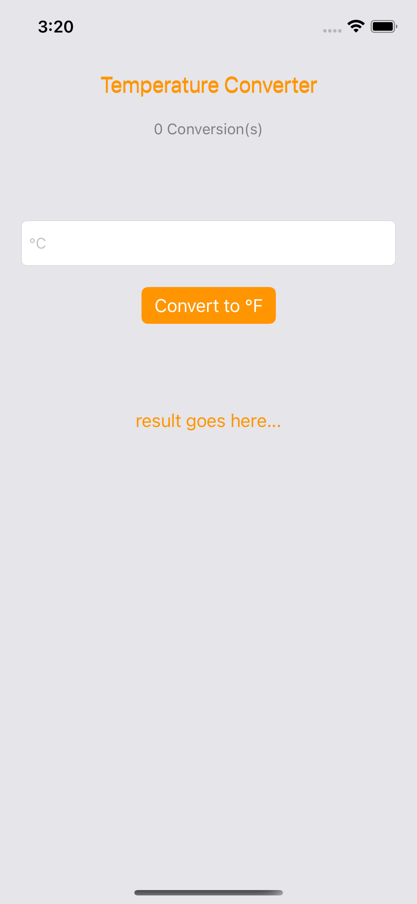
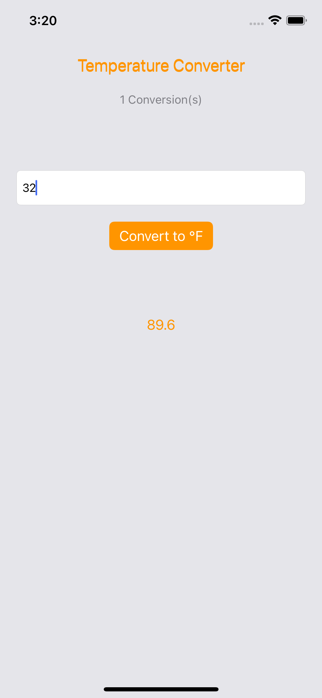
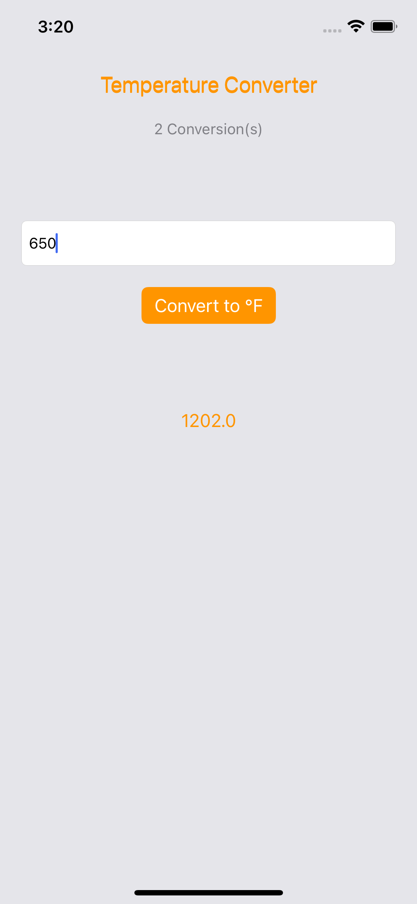

# Temperature Converter
Convert temperature from °C to °F. Also shows a count of conversions done.

## Screenshots

  
  &nbsp;
  
  &nbsp;
  

## Tech
- Swift with Storyboard

## External Packages
N/A